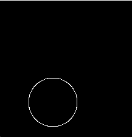
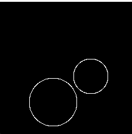
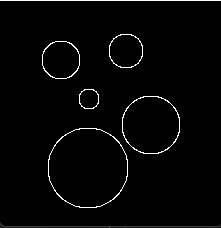

# edge and boundary detection
For any given image we can detect edges using Canny edge detector, detect lines, circles, ellipsed located in the image (if any). also, we implemented the the Active Contour Model (snake) using the greedy algorithm.

## Active Contour

Active contour defines a separate boundary or curvature for the regions of target object for segmentation. This implementation is based on Greedy Algorithm.

Esnake(x, y) = α Eela (x, y) + β Ecurv(x, y) + γ Eimg(x, y) , Where Eela(x, y) is the elasticity energy, Ecurv(x, y) is the curvature energy, Eimg(x, y) is the image energy.

The parameters' values of alpha, beta, gamma and number of iterations are selected by trial and error approach.

##### Original image

##### Contour image

As shown in the image we still have a problem with implementing the active contour as it is not giving us the optimal result.

### circle detection using hough transform
it uses hough transform which transfer each edge point into 3d array containing a,b,r depending on the equation of the circle.
you can use different thresholds as a parameter in the implemented function, also you can change the radius needed to be searched for.

#### Results

##### Original image

##### canny detected image

##### using small radius <11 image

##### using big radius >30 image

##### using big radius >20 image

##### using all raduii image

